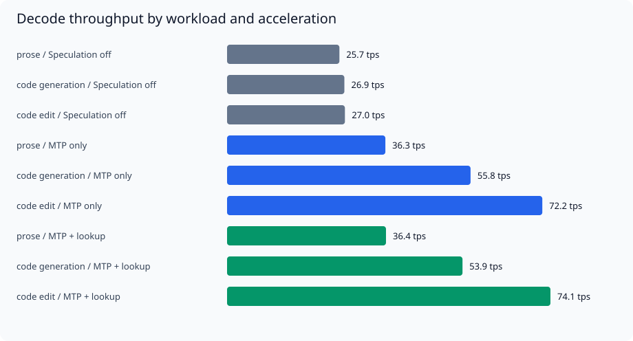
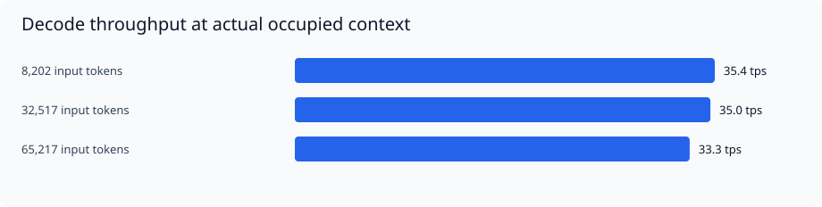

# FlashNextVelocity Benchmark Report

> **PARTIAL** · 2026-10-02T03:18:37.435452+00:00 · Suite v1 · production sampling

## 1. Executive Summary

| Measure | Result |
| --- | --- |
| Completed conditions | 15/16 |
| Measured requests | 43/49 successful |
| Warmup / setup requests | 6 / 5 |
| Elapsed time | 15.4 minutes |
| Time limit | 45 minutes |
| Basic correctness checks | 43/43 passed |
| Profiling | Disabled for throughput measurements |

**Rates apply to the listed workloads and conditions. No single rate represents every task.**

**Run notes:**

- conversation could not finish: Engine returned an invalid decode rate.

| Workload | Off tps | MTP tps | MTP + lookup tps | Full / off |
| --- | --- | --- | --- | --- |
| prose | 25.7 | 36.3 | 36.4 | 1.41x |
| code generation | 26.9 | 55.8 | 53.9 | 2.01x |
| code edit | 27.0 | 72.2 | 74.1 | 2.74x |

Ratios describe observed throughput in this grouped run. Consult correctness results before treating them as completed-task gains.



## 2. System and Software Configuration

| Setting | Value |
| --- | --- |
| CPU | AMD RYZEN AI MAX+ 395 w/ Radeon 8060S           |
| OS | Microsoft Windows 11 Pro |
| OS build | 26200 |
| Installed RAM | 128.0 GiB |
| RAM configured speed | 8000 MT/s |
| GPU / driver | Microsoft Remote Display Adapter / 10.0.26100.9278; AMD Radeon(TM) 8060S Graphics / 32.0.31041.1004 |
| Power plan | Power Scheme GUID: e6bdbc32-f927-41a8-aff4-93df4fd4484c  (Ultimate Performance) |
| Backend | FlashNextVelocity / ROCm HIP / gfx1151 |
| Loaded HIP runtime file version | 10.0.3581.0 |
| Engine runtime revision | fnv-mtp-cache-replay-v13 |
| Git commit | b58deeb81e19b250222fe259d223339c8634543a |
| Working tree | Contains local changes |
| Context capacity | 67584 |
| Preset | production |
| Sampling | temperature=0.35, top_p=0.9, top_k=20, min_p=0, repeat_penalty=1, repeat_last_n=512, frequency_penalty=0, presence_penalty=0 |
| Target model | Qwen3.8-Flash-Next-UD-Q4_K_XL-00001-of-00004.gguf |
| MTP sidecar | mtp-Qwen3.8-Flash-Next-shared-Q8_0.gguf |

Full asset hashes, per-mode settings, fixture hashes, and request settings are in [raw-results.json](benchmark-reports/20261002-031837Z/raw-results.json).

## 3. Benchmark Methodology

- One client; three sequential engine loads: speculation off, MTP only, MTP plus context lookup.
- 3 repetitions per condition; one longer generation. Seed schedule: 12345, 23456, 34567.
- Most outputs are capped at 256 tokens; compact JSON/tool tasks at 128; longer generation at 1,024. Natural early stops are retained and labeled.
- Six planned warmups: one per mode and one per context depth. Calibration and continuation priming are setup requests, excluded from performance medians.
- Fresh chat requests diverge from the preceding generated session. This native engine resets recurrent state on divergence. Conversation continuation uses the separate raw-completion API and has an explicitly matched fresh control.
- Context inputs are snapshots of actual repository documents and code, not repeated single-token filler. The requested depths are approximate; actual token counts are reported.
- Thinking, vision, and the private Studio agent prompt are disabled for this text suite. Context capacity is identical across modes and raised to at least 67,584 tokens for the 64k test.
- Client first response timing starts before sending the request and ignores role, heartbeat, and usage events. Tool responses may be buffered until a complete call exists.
- Engine decode tps = generated tokens / engine decode seconds. Client total time includes the HTTP request and streaming delivery. These are different measurement boundaries.
- Streaming gaps are intervals between meaningful payload events, not exact per-token GPU latency. Draft IDs and hidden tokens are not counted as accepted output.
- Reported prefill tps is used only for fresh prompts. Continuation reports prefill milliseconds because the engine does not expose the actual number of newly processed tokens.
- Engine loading uses the existing OS file cache; these are not cold-disk load tests.

Exact input snapshots: [inputs.json](benchmark-reports/20261002-031837Z/inputs.json). No generated tool or code is executed.

## 4. Performance Results

### 4.1 Workloads and Acceleration

| Workload | Acceleration | Input / output tokens | Decode tps: median [range] | Client first response ms | Total s | Runs |
| --- | --- | --- | --- | --- | --- | --- |
| prose | Speculation off | 101 / 256 | 25.7 [25.7–26.6] | 297.3 | 10.2 | 3/3 |
| code generation | Speculation off | 111 / 256 | 26.9 [26.6–26.9] | 311.7 | 9.8 | 3/3 |
| code edit | Speculation off | 152 / 74 | 27.0 [26.9–27.1] | 348.1 | 3.1 | 3/3 |
| prose | MTP only | 101 / 256 | 36.3 [36.1–36.7] | 310.0 | 7.3 | 3/3 |
| code generation | MTP only | 111 / 256 | 55.8 [52.4–57.2] | 337.0 | 4.9 | 3/3 |
| code edit | MTP only | 152 / 74 | 72.2 [71.6–72.5] | 405.3 | 1.4 | 3/3 |
| prose | MTP + lookup | 101 / 256 | 36.4 [36.2–37.0] | 306.4 | 7.3 | 3/3 |
| code generation | MTP + lookup | 111 / 256 | 53.9 [51.5–56.7] | 359.4 | 5.0 | 3/3 |
| code edit | MTP + lookup | 152 / 74 | 74.1 [74.0–74.9] | 394.0 | 1.3 | 3/3 |

### 4.2 Context Depth



| Condition | Actual input / output tokens | Decode tps: median [range] | Fresh prefill tps | Client first response ms | Runs |
| --- | --- | --- | --- | --- | --- |
| context-8192 | 8202 / 256 | 35.4 [35.4–37.1] | 1,289.5 | 6,479.2 | 3/3 |
| context-32768 | 32517 / 256 | 35.0 [34.8–37.2] | 1,132.9 | 28,902.7 | 3/3 |
| context-65536 | 65217 / 256 | 33.3 [33.1–34.9] | 1,135.5 | 57,713.4 | 3/3 |

### 4.3 Structured Output and Sustained Generation

| Condition | Input / output tokens | Decode tps: median [range] | First response ms | Checks | Early stops |
| --- | --- | --- | --- | --- | --- |
| structured_json | 101 / 17, 24 | 61.3 [57.3–63.6] | 360.3 | 3/3 | 3 |
| tool_call | 370 / 40 | 63.0 [62.9–64.2] | 1,192.7 | 3/3 | 3 |
| sustained | 114 / 1024 | 38.6 [38.6–38.6] | 316.7 | 1/1 | 0 |

Longer-generation 64-token window rates are retained in the raw results. An output shorter than 1,024 tokens is not evidence of sustained speed over 1,024 tokens.

### 4.4 Conversation Continuation

| Request | Actual input / output tokens | Engine first token ms | Prefill ms | Total s | Notes |
| --- | --- | --- | --- | --- | --- |

Continuation is an attempt to extend the exact raw prefix. Re-tokenization or EOS can prevent reuse; the API does not expose cached-token counts, so reuse is not asserted as proven.

### 4.5 Speculation and Streaming

| Condition | MTP acceptance | MTP accepted / output | Lookup accepted / output | Median longest payload gap ms |
| --- | --- | --- | --- | --- |
| prose-off | N/A | 0.000 | 0.000 | 42.0 |
| code_generation-off | N/A | 0.000 | 0.000 | 39.2 |
| code_edit-off | N/A | 0.000 | 0.000 | 38.4 |
| prose-mtp | 69.6% | 0.441 | 0.000 | 86.1 |
| code_generation-mtp | 78.0% | 0.750 | 0.000 | 101.6 |
| code_edit-mtp | 91.3% | 0.851 | 0.000 | 106.0 |
| prose-mtp_lookup | 69.6% | 0.441 | 0.000 | 81.8 |
| code_generation-mtp_lookup | 76.9% | 0.742 | 0.000 | 103.8 |
| code_edit-mtp_lookup | 100.0% | 0.216 | 0.662 | 150.9 |
| context-8192 | 67.6% | 0.465 | 0.000 | 96.7 |
| context-32768 | 69.8% | 0.520 | 0.004 | 92.7 |
| context-65536 | 62.0% | 0.523 | 0.000 | 118.5 |
| structured_json | 87.5% | 0.824 | 0.000 | 105.4 |
| tool_call | 100.0% | 0.750 | 0.075 | N/A |
| sustained | 71.9% | 0.512 | 0.000 | 106.3 |

Acceptance is N/A when no proposals occurred. High acceptance alone does not establish a throughput improvement.

### 4.6 Memory and Loading

| Mode | Engine load s | Sampled minimum free RAM GiB | Sampled maximum GPU local/shared GiB |
| --- | --- | --- | --- |
| Speculation off | 35.9 | 7.0 | 82.7 / 0.0 |
| MTP only | 22.0 | 7.9 | 86.0 / 0.0 |
| MTP + lookup | 22.0 | 7.6 | 86.1 / 0.0 |

Memory is sampled at request boundaries, not a guaranteed peak/minimum. GPU allocations are not added to host RAM usage on this unified-memory machine. Temperatures, clock traces, board power, and physical NVMe throughput are unavailable in this suite.

## 5. Correctness and Reliability

JSON checks exact values; tool checks validate the simulated function and arguments; code editing compares Python ASTs; code generation checks syntax and function presence. Prose checks only a nonempty response. These are basic integrity checks, not a comprehensive quality evaluation.

No measured request failed the basic integrity checks.

## 6. Analysis and Limitations

- Compare matching workload rows, occupied context, token caps, model hashes, sampling, and cache conditions. Model/backend changes require an explicitly labeled comparison.
- Three repetitions support medians and ranges, not reliable tail-latency percentiles or small-gain claims. No p95/p99 request latency is inferred.
- Capped outputs can truncate code or tasks. The speed remains measured, but a failed task check is not a useful completed answer.
- This API benchmark includes sampling and serving. It is not a llama-bench pp/tg microbenchmark, and its rates should not be ranked directly against those numbers.
- Modes are grouped to avoid repeated model loads. This is not an interleaved A/B experiment; temperature and clock drift can influence mode comparisons.
- Long context uses one repository corpus and is not a broad retrieval-quality benchmark. No multi-client serving, vision, reasoning-on, or overnight stability test is included.
- Pure GPU graph timing is not reported; completion waits cannot be assumed to be removable overhead.

## 7. Reproducibility Appendix

- [Raw results and effective settings](benchmark-reports/20261002-031837Z/raw-results.json)
- [Per-request CSV](benchmark-reports/20261002-031837Z/requests.csv)
- [Exact fixtures and context snapshots](benchmark-reports/20261002-031837Z/inputs.json)
- Benchmark runner SHA-256: `38c1d1ed37496559e06bcebd5a2fe5d6d72d39deb0b2a7c57028d802d28533e0`

<details>
<summary>Model, sidecar, binary, and runtime fingerprints</summary>

| Role | File | GiB | SHA-256 |
| --- | --- | --- | --- |
| target | Qwen3.8-Flash-Next-UD-Q4_K_XL-00001-of-00004.gguf | 0.010 | `4448186216b3af4cc558bbce2c3213f01608f8f8b2e5267a9767971dd3ec8082` |
| target | Qwen3.8-Flash-Next-UD-Q4_K_XL-00002-of-00004.gguf | 46.435 | `3f342f1c1580473f1ee94ddd5b28206e8c07a70fa1a366f59d1d6c922919a6c9` |
| target | Qwen3.8-Flash-Next-UD-Q4_K_XL-00003-of-00004.gguf | 45.985 | `56758f40269cad5cd9b0d3d6fbae0f40f6d5be6de49e4ab392dbe83157d9cbd3` |
| target | Qwen3.8-Flash-Next-UD-Q4_K_XL-00004-of-00004.gguf | 11.258 | `753bda48b98ba4f1636134a90a967de1b2d3908a236c026e464777342e53510a` |
| mtp | mtp-Qwen3.8-Flash-Next-shared-Q8_0.gguf | 2.595 | `5ff54097406a905cf3a724c709124ceb0e3e10235ee862298969e91c96fa96e6` |
| engine | FlashNextVelocity.Engine.exe | 0.009 | `574440684f55b3c12a99b86bddb4ccfe3c623a2d4c44eae85063e976d388cf86` |
| runtime | amdhip64_7.dll | 0.015 | `546fb3d6e2d2194a9526fb94ec2fd3aa5b92a48a7595f04efece80162047ef69` |
| runtime | rocblas.dll | 0.020 | `8ecbe340d8052e5292a47b96f3c93c20767ced0032db47851b792da7039d1e0b` |

</details>

<details>
<summary>Effective benchmark configuration by acceleration mode</summary>

**Speculation off**

```json
{
  "model": "Qwen3.8-Flash-Next-UD-Q4_K_XL-00001-of-00004.gguf",
  "mtp": "",
  "mmproj": "",
  "host": "127.0.0.1",
  "port": 18080,
  "context": 67584,
  "draft_max": 7,
  "draft_confidence": 0.75,
  "mtp_draft_vocabulary": "latin",
  "mtp_proposal_mode": "distribution",
  "prefill_batch": 4096,
  "context_lookup": false,
  "context_lookup_min_ngram": 5,
  "context_lookup_max_ngram": 7,
  "context_lookup_window": 32768,
  "context_lookup_min_draft": 6,
  "context_lookup_max_draft": 16,
  "context_lookup_policy": "sticky",
  "context_lookup_capacity": 16,
  "memory_guard": true,
  "memory_guard_min_available_gib": 3,
  "sessions": 1,
  "default_max_tokens": 32768,
  "thinking": false,
  "preserve_thinking": false,
  "reasoning_effort": "medium",
  "sampling": {
    "temperature": 0.35,
    "top_p": 0.9,
    "top_k": 20,
    "min_p": 0,
    "repeat_penalty": 1,
    "repeat_last_n": 512,
    "frequency_penalty": 0,
    "presence_penalty": 0,
    "seed": 12345
  }
}
```

**MTP only**

```json
{
  "model": "Qwen3.8-Flash-Next-UD-Q4_K_XL-00001-of-00004.gguf",
  "mtp": "mtp-Qwen3.8-Flash-Next-shared-Q8_0.gguf",
  "mmproj": "",
  "host": "127.0.0.1",
  "port": 18080,
  "context": 67584,
  "draft_max": 7,
  "draft_confidence": 0.75,
  "mtp_draft_vocabulary": "latin",
  "mtp_proposal_mode": "distribution",
  "prefill_batch": 4096,
  "context_lookup": false,
  "context_lookup_min_ngram": 5,
  "context_lookup_max_ngram": 7,
  "context_lookup_window": 32768,
  "context_lookup_min_draft": 6,
  "context_lookup_max_draft": 16,
  "context_lookup_policy": "sticky",
  "context_lookup_capacity": 16,
  "memory_guard": true,
  "memory_guard_min_available_gib": 3,
  "sessions": 1,
  "default_max_tokens": 32768,
  "thinking": false,
  "preserve_thinking": false,
  "reasoning_effort": "medium",
  "sampling": {
    "temperature": 0.35,
    "top_p": 0.9,
    "top_k": 20,
    "min_p": 0,
    "repeat_penalty": 1,
    "repeat_last_n": 512,
    "frequency_penalty": 0,
    "presence_penalty": 0,
    "seed": 12345
  }
}
```

**MTP + lookup**

```json
{
  "model": "Qwen3.8-Flash-Next-UD-Q4_K_XL-00001-of-00004.gguf",
  "mtp": "mtp-Qwen3.8-Flash-Next-shared-Q8_0.gguf",
  "mmproj": "",
  "host": "127.0.0.1",
  "port": 18080,
  "context": 67584,
  "draft_max": 7,
  "draft_confidence": 0.75,
  "mtp_draft_vocabulary": "latin",
  "mtp_proposal_mode": "distribution",
  "prefill_batch": 4096,
  "context_lookup": true,
  "context_lookup_min_ngram": 5,
  "context_lookup_max_ngram": 7,
  "context_lookup_window": 32768,
  "context_lookup_min_draft": 6,
  "context_lookup_max_draft": 16,
  "context_lookup_policy": "sticky",
  "context_lookup_capacity": 16,
  "memory_guard": true,
  "memory_guard_min_available_gib": 3,
  "sessions": 1,
  "default_max_tokens": 32768,
  "thinking": false,
  "preserve_thinking": false,
  "reasoning_effort": "medium",
  "sampling": {
    "temperature": 0.35,
    "top_p": 0.9,
    "top_k": 20,
    "min_p": 0,
    "repeat_penalty": 1,
    "repeat_last_n": 512,
    "frequency_penalty": 0,
    "presence_penalty": 0,
    "seed": 12345
  }
}
```

</details>

Generated locally by `BENCHMARK-REPORT.bat`. No upload or Git publication is performed.
